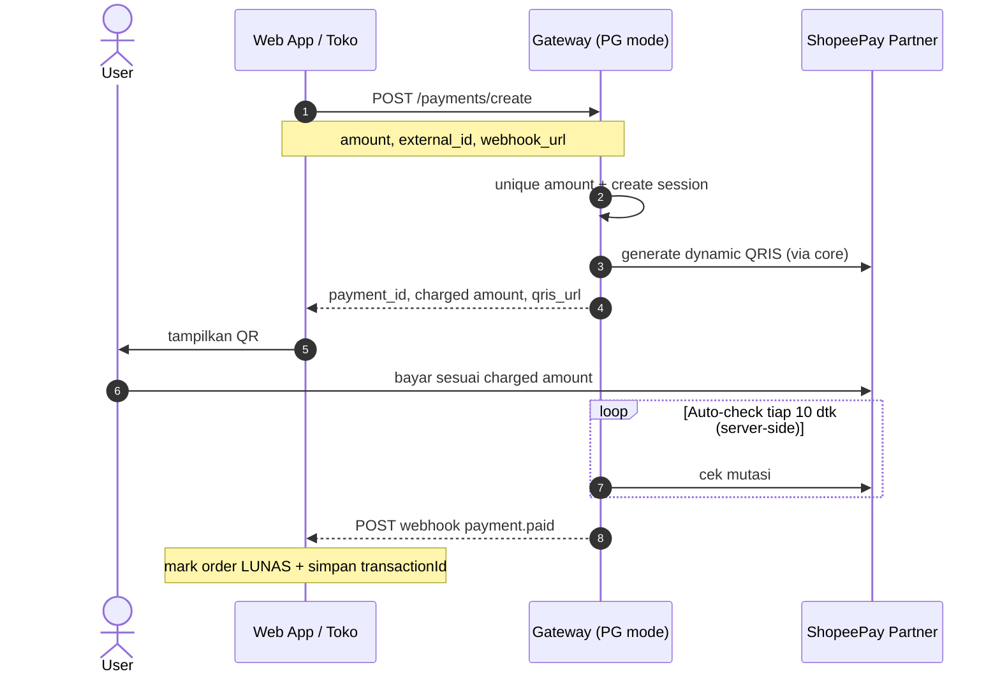

# 🚀 ShopeePay Partner API Gateway — PG Auto-Check Edition (Fork)

[](https://nodejs.org)
[](https://expressjs.com)
[](docs/AUTO-CHECK-PG.md)
[](https://en.wikipedia.org/wiki/Proprietary_software)

> **Fork of** [ahmadzakiyox/shoppepay-api-gateway](https://github.com/ahmadzakiyox/shoppepay-api-gateway)  
> **Maintainer fork:** [fadheelahmadalfaiz/shoppepay-api-gateway](https://github.com/fadheelahmadalfaiz/shoppepay-api-gateway)

Unofficial ShopeePay Partner gateway dengan **layer Payment Gateway (PG) auto-check**:
buat payment → tampilkan QR → **server auto-poll** mutasi → mark `paid` → optional **webhook** ke web app + notifikasi Telegram.

### Docs fokus
- [`docs/AUTO-CHECK-PG.md`](docs/AUTO-CHECK-PG.md) — cara pakai PG layer
- [`docs/WEBAPP-INTEGRATION.md`](docs/WEBAPP-INTEGRATION.md) — integrasi web app (create / webhook / status)
- [`docs/AI-INTEGRATION-SPEC.md`](docs/AI-INTEGRATION-SPEC.md) — handoff lengkap untuk AI (opsional)

---

> [!IMPORTANT]
> ### ⚠️ Disclaimer: Unofficial Gateway
>
> Proyek ini adalah **Unofficial API Gateway** yang **TIDAK berafiliasi, TIDAK didukung, dan TIDAK disetujui secara resmi oleh PT. Shopee International Indonesia atau Sea Group** dalam kapasitas apapun.
>
> Gateway ini bekerja dengan cara membaca data dari **ShopeePay Partner Portal** secara teknis menggunakan sesi akun merchant Anda sendiri (token internal), serupa dengan cara kerja extension browser atau skrip otomasi pihak ketiga.
>
> **Penggunaan sepenuhnya menjadi tanggung jawab pengguna.** Pastikan Anda memahami Syarat & Ketentuan ShopeePay Partner yang berlaku sebelum memakai di produksi.

---

## ✨ Apa yang berubah di fork ini?

| Upstream (asli) | Fork ini (PG auto-check) |
|---|---|
| Client harus poll `POST /check-payment` | Server **auto-poll** pending payments |
| Tidak ada session payment | Ada `payment_id` session + persist file |
| Tidak ada webhook | Optional `webhook_url` → event `payment.paid` |
| `server.js` = core obfuscated | Core dipindah ke `core-gateway.js` |
| Entry = core saja | Entry `server.js` spawn core + expose PG API |
| Amount collision manual | `UNIQUE_AMOUNT=true` → `base + 1..99` otomatis |

### Arsitektur singkat

```text
Public PORT (server.js)
  ├── /payments/*          session + auto-check + webhook
  └── proxy → CORE_PORT    core-gateway.js (obfuscated)
                 └── ShopeePay Partner API
```

Endpoint lama (`/create-qris`, `/check-payment`, `/transactions`, …) **tetap hidup** via proxy.

---

## 🧭 Alur PG Auto-Check (disarankan untuk web app)



Kalau webhook tidak di-set, web app bisa poll: `GET /payments/:id?refresh=1`.

---

## 🎯 Fitur

### PG layer (baru)
- **`POST /payments/create`** — create payment + QR + mulai auto-check
- **Auto-poll server-side** — default tiap 10 detik, max ~20 menit
- **Webhook `payment.paid`** — POST ke URL web app (retry 3x)
- **Telegram notify** saat lunas (opsional)
- **Unique amount** otomatis (`UNIQUE_AMOUNT=true`)
- **Anti double-claim `transactionId`** (file persist)
- **Session persist** di `PAYMENT_STORE_PATH` (default `./data/payments.json`)
- **Rewrite `qris_url`** ke host publik (bukan `127.0.0.1:CORE_PORT`)

### Core (tetap ada)
- Dynamic QRIS EMVCo injector (Tag `54` + CRC16)
- Token validator + alert Telegram jika token mati
- Mutasi terbaru / sebulan
- Multi-merchant header `X-Shopee-Token`
- Legacy client-polled `/check-payment`

---

## 📁 Struktur penting

```text
server.js                 # entry PG (npm start)
core-gateway.js           # core obfuscated (internal CORE_PORT)
lib/payment-store.js      # session store + claim map
lib/auto-checker.js       # poller + webhook + telegram paid
routes/payments.js        # /payments/*
docs/AUTO-CHECK-PG.md
docs/WEBAPP-INTEGRATION.md
docs/AI-INTEGRATION-SPEC.md
.env.example
```

---

## 📋 Cara mengambil `SHOPEE_TOKEN`

1. Login ke [ShopeePay Partner Portal](https://partner.shopee.co.id/).
2. Buka **Developer Tools** (`F12`) → tab **Network**.
3. Filter **Fetch/XHR**, refresh halaman transaksi.
4. Cari request `get-transaction-list`.
5. Request payload → `data.metadata.token`.
6. Salin token (biasanya diawali `B:`) ke env `SHOPEE_TOKEN`.

---

## 🧾 Cara mengambil `QRIS_STATIC`

1. Ambil **QRIS statis** merchant ShopeePay (portal partner / print toko).
2. Decode QR menjadi **raw EMV string** (biasanya mulai `000201...`).
3. Tempel 1 baris penuh ke env `QRIS_STATIC`.

| Env | Fungsi |
|---|---|
| `SHOPEE_TOKEN` | baca mutasi / status bayar |
| `QRIS_STATIC` | template generate QR dinamis |

---

## 🛠️ Environment (`.env`)

```env
# === Core ===
SHOPEE_TOKEN=B:your_inner_shopeepay_token_here
API_KEY=your_x_api_key_here
PORT=4000
CORE_PORT=4001

# Telegram (token mati + notif paid)
TELEGRAM_BOT_TOKEN=your_telegram_bot_token_here
TELEGRAM_CHAT_ID=your_telegram_chat_id_here

# QRIS static payload (EMVCo)
QRIS_STATIC=00020101021126610016ID.CO.SHOPEE.WWW0118...

# === PG auto-check ===
AUTO_CHECK_INTERVAL_MS=10000
AUTO_CHECK_MAX_POLLS=120
UNIQUE_AMOUNT=true
PAYMENT_STORE_PATH=./data/payments.json
```

| Key | Default | Keterangan |
|---|---|---|
| `CORE_PORT` | `4001` | port internal core |
| `AUTO_CHECK_INTERVAL_MS` | `10000` | interval auto-poll |
| `AUTO_CHECK_MAX_POLLS` | `120` | max poll / payment |
| `UNIQUE_AMOUNT` | `true` | tambah +1..99 anti tabrakan |
| `PAYMENT_STORE_PATH` | `./data/payments.json` | persist session |

> **Webhook URL tidak di-set di env gateway.**  
> Web app mengirim `webhook_url` **per request** ke `POST /payments/create`.

Contoh webhook web app:
`https://fh-event.lovable.app/api/public/shopeepay-webhook`

---

## 📑 Referensi API

Auth (hampir semua endpoint):
```http
X-API-Key: <API_KEY>
```

### A) PG Auto-Check — utama untuk web app

#### 1. Health
```http
GET /api/health
```
Harus ada `"mode": "pg-auto-check"` jika entrypoint benar.

#### 2. Create payment
```http
POST /payments/create
Content-Type: application/json
X-API-Key: <API_KEY>
```

```json
{
  "amount": 15000,
  "external_id": "ORDER-123",
  "webhook_url": "https://fh-event.lovable.app/api/public/shopeepay-webhook",
  "metadata": { "order_id": "ORDER-123" }
}
```

Response penting:
- `payment_id`
- `amount` → **charged amount** (bisa `base + suffix`)
- `base_amount`
- `qris_url`
- `auto_check: true`

#### 3. Status payment
```http
GET /payments/:id
GET /payments/:id?refresh=1
```

Status: `pending` | `paid` | `expired` | `cancelled`

#### 4. Force check / cancel / list
```http
POST /payments/:id/check
POST /payments/:id/cancel
GET  /payments?status=pending&limit=20
```

#### 5. Webhook payload (saat lunas)
Gateway `POST` ke `webhook_url` yang dikirim saat create:

```json
{
  "event": "payment.paid",
  "payment_id": "pay_...",
  "external_id": "ORDER-123",
  "amount": 15047,
  "status": "paid",
  "transaction": {
    "transactionId": "...",
    "amount": 15047,
    "status": "success",
    "time": "2026-07-18 19:23:29",
    "issuer": "Gopay"
  },
  "metadata": {},
  "paid_at": "2026-07-18T12:24:01.000Z"
}
```

Web app wajib:
1. idempotent (order sudah paid → 200)
2. unique `transactionId`
3. mark order paid hanya dari event ini / status `paid`

---

### B) Legacy core routes (tetap tersedia)

```http
POST /create-qris          { "amount": 15000 }
POST /check-payment        { "amount": 15000, "startTime": 1710000000 }
GET  /qr/:id
GET  /token-status
GET  /transactions
GET  /transactions/all
POST /update-token         { "token": "B:..." }
GET  /api/logs
```

`startTime` pada `/check-payment` = unix **seconds**.  
Multi-merchant opsional: header `X-Shopee-Token: B:...`

---

## 💻 Contoh integrasi web app (ringkas)

```js
// 1) create payment
const created = await fetch(`${process.env.SHOPEEPAY_BASE_URL}/payments/create`, {
  method: 'POST',
  headers: {
    'Content-Type': 'application/json',
    'X-API-Key': process.env.SHOPEEPAY_API_KEY,
  },
  body: JSON.stringify({
    amount: order.total,
    external_id: order.id,
    webhook_url: process.env.SHOPEEPAY_WEBHOOK_URL,
    // contoh: https://fh-event.lovable.app/api/public/shopeepay-webhook
    metadata: { order_id: order.id },
  }),
}).then((r) => r.json());

// simpan: payment_id, amount (charged), qris_url
// tampilkan qris_url ke user

// 2) webhook di web app:
// POST /api/public/shopeepay-webhook
// if event == payment.paid → mark order paid (unique transactionId)
```

Detail: [`docs/WEBAPP-INTEGRATION.md`](docs/WEBAPP-INTEGRATION.md)

---

## 🛡️ Penanganan kolisi nominal

Upstream memakai dedup `transactionId` di RAM + rekomendasi unique amount di sisi toko.

Di fork ini ditambah:
1. **`UNIQUE_AMOUNT=true`** → charged amount = `base + 1..99` otomatis
2. **Claim store file** untuk `transactionId` (lebih tahan restart daripada RAM saja)
3. **Rekomendasi tetap**: web app juga unique-index `transactionId`

---

## 🚀 Deployment

### Start command (penting)
```bash
npm start
# = node server.js   (bukan node core-gateway.js)
```

### Build command
`npm run build` sekarang **no-op** (core sudah prebuilt di `core-gateway.js`).  
Jangan kembalikan script obfuscator ke `build` — Nixpacks/EasyPanel akan gagal (`javascript-obfuscator: not found`).

### EasyPanel / Nixpacks
1. Builder: **Nixpacks** (atau Railpack)
2. Install: kosong (auto)
3. Build: kosong / no-op
4. Start: **`npm start`**
5. Isi env dari tabel di atas
6. Cek `GET /api/health` → `mode: pg-auto-check`

### VPS + PM2
```bash
git clone https://github.com/fadheelahmadalfaiz/shoppepay-api-gateway.git
cd shoppepay-api-gateway
npm install --omit=dev
cp .env.example .env   # lalu edit secret
mkdir -p data
pm2 start server.js --name shoppepay-gateway
pm2 save
```

Atau pakai `./deploy.sh` (sudah mengarah ke fork ini).

---

## 🧪 Smoke test

```bash
BASE=https://your-host
KEY=your_api_key

curl -sS "$BASE/api/health" | jq .mode
# expect: "pg-auto-check"

curl -sS -X POST "$BASE/payments/create" \
  -H "Content-Type: application/json" \
  -H "X-API-Key: $KEY" \
  -d '{"amount":1000,"external_id":"TEST-1","webhook_url":"https://fh-event.lovable.app/api/public/shopeepay-webhook"}' | jq
```

---

## ⚡ Error umum

| Gejala | Penyebab | Solusi |
|---|---|---|
| `401 Unauthorized` | API key salah/kosong | cek header `X-API-Key` |
| `200020` / token invalid | sesi partner mati | `POST /update-token` dengan token baru |
| Deploy `javascript-obfuscator: not found` | Nixpacks jalanin old `npm run build` | pakai build no-op / kosongkan build command |
| Health tanpa `pg-auto-check` | start core saja / image lama | `npm start` + redeploy `main` |
| Webhook `order not found` | `external_id` tidak ada di web app | kirim order id valid saat create |
| QR URL `127.0.0.1` | versi lama / host header hilang | pakai fork terbaru (rewrite host) |
| Selalu unpaid | amount mismatch / token invalid / expired | pakai **charged amount**, cek `/token-status` |

---

## 📚 Dokumentasi tambahan

| File | Isi |
|---|---|
| [docs/AUTO-CHECK-PG.md](docs/AUTO-CHECK-PG.md) | Detail PG layer |
| [docs/WEBAPP-INTEGRATION.md](docs/WEBAPP-INTEGRATION.md) | Fokus koneksi web app |
| [docs/AI-INTEGRATION-SPEC.md](docs/AI-INTEGRATION-SPEC.md) | Spec panjang untuk AI handoff |

---

## 🔒 Lisensi

Proyek ini menggunakan lisensi **Proprietary (Komersial)**. Hak cipta dilindungi undang-undang. Dilarang keras menyebarluaskan, membongkar berkas biner (*reverse engineering*), mendekompilasi, atau memperjualbelikan kembali kode sumber/aplikasi ini tanpa izin tertulis dari pemilik hak cipta resmi.

---

## 🙏 Credit

- Upstream core: [ahmadzakiyox/shoppepay-api-gateway](https://github.com/ahmadzakiyox/shoppepay-api-gateway)
- Fork PG auto-check layer: session store, auto-poller, webhook, unique amount, docs
