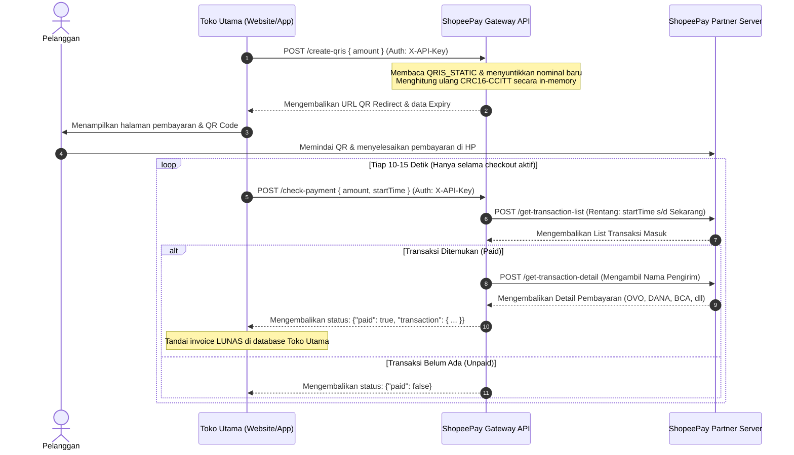

# 🚀 ShopeePay Partner API Gateway (Stateless Edition)

[](https://nodejs.org)
[](https://expressjs.com)
[](https://en.wikipedia.org/wiki/Stateless_protocol)
[](https://en.wikipedia.org/wiki/Proprietary_software)

API Gateway berkinerja tinggi, ringan, dan **100% Stateless (tanpa database & tanpa background polling cron)** untuk otomatisasi verifikasi mutasi transaksi ShopeePay Partner, validasi token, penarikan riwayat bulanan, serta pembuatan dynamic QRIS EMVCo secara instan.

---

## 🧭 Diagram Alur Pengecekan Stateless (Client-Polled)

Arsitektur ini didesain agar sangat aman dari deteksi pemblokiran (*rate-limit*) Shopee, karena gateway hanya memanggil API ShopeePay secara pasif saat dipicu oleh halaman checkout aktif di website Toko Anda.



---

## 🎯 Fitur Utama & Keunggulan

*   **Zero-Database (100% Stateless)**: Tidak memerlukan penyimpanan lokal (SQLite/PostgreSQL) sehingga kebal terhadap kehilangan data akibat restart berkala di cloud serverless gratis (Render, Vercel, Railway).
*   **Dynamic QRIS EMVCo Injector**: Melakukan parsing TLV (*Tag-Length-Value*) pada QRIS statis Anda, menyuntikkan nominal tagihan (Tag `54`), dan menghitung ulang standard check-sum **CRC16-CCITT** secara in-memory.
*   **Smart API Polling (Anti-Block)**: Aktivitas penembakan API ke ShopeePay mengikuti jumlah pembeli yang sedang aktif di checkout. Saat toko sepi/malam hari, jumlah request adalah nol (0), menjaga token tetap aman dari *rate-limiting*.
*   **Dynamic Multi-Token (Multi-Store Routing)**: Mendukung pengelolaan multi-akun/merchant. Anda dapat mengirimkan token Shopee yang berbeda via header HTTP `X-Shopee-Token` di setiap request.
*   **Automatic Issuer Resolution**: Melakukan query data sekunder untuk mendeteksi metode/aplikasi pembayaran asal pengirim (seperti Seabank, OVO, DANA, BCA, Bank Mandiri, dll).
*   **Live Token Validator & Alert Telegram**: Melakukan uji coba token setiap 5 menit. Jika terdeteksi mati atau dikeluarkan (*force logout*), notifikasi diagnostik detail akan dikirim langsung ke Bot Telegram Anda.
*   **In-Memory Transaction Deduplication (Anti-Double Claim)**: Mengamankan verifikasi nominal kembar secara stateless. Gateway secara otomatis mencatat `transactionId` yang sukses diklaim ke dalam RAM (dibersihkan otomatis setiap 24 jam) untuk mencegah manipulasi klaim ganda.
*   **In-Memory Circular Logs**: Menyimpan 100 log aktivitas terakhir di RAM server untuk pemantauan operasional yang mudah diakses via endpoint terproteksi `/api/logs`.

---

## 🛡️ Penanganan Kolisi Nominal Kembar (Payment Collisions)

Karena API ini bersifat *Stateless* (tanpa database permanen), jika ada dua pelanggan berbeda melakukan checkout dengan nominal yang sama persis (misalnya Rp 50.000) pada waktu bersamaan, sistem rawan mengalami *double claim* (satu bukti bayar diklaim oleh dua orang berbeda).

Untuk mencegah hal tersebut, sistem ini didesain menggunakan pengaman ganda:

1.  **Deduplikasi di Sisi API Gateway (In-Memory Tracking)**:
    API Gateway secara dinamis menyimpan `transactionId` yang sukses divalidasi ke dalam memori *Map* server (RAM). Jika ada transaksi verifikasi masuk menggunakan nomor resi yang sudah pernah terpakai dalam 24 jam terakhir, gateway akan otomatis mengabaikannya (`paid: false`).
2.  **Rekomendasi di Sisi Aplikasi Toko Utama**:
    *   **Gunakan Kode Unik**: Tambahkan kode unik (Rp 1 s/d Rp 99) pada nominal tagihan yang dihasilkan oleh aplikasi Anda saat membuat QRIS.
    *   **Deduplikasi Database Toko**: Simpan data `transactionId` yang dikembalikan oleh respon sukses `/check-payment` ke database aplikasi Anda. Pastikan sistem Anda menolak proses kelunasan jika `transactionId` tersebut sudah pernah terdaftar di database Anda sebelumnya.

---

## 📋 Cara Mengambil `SHOPEE_TOKEN`

Untuk mendapatkan token internal ShopeePay (`SHOPEE_TOKEN`):
1.  Buka browser Anda dan login ke [ShopeePay Partner Portal](https://partner.shopee.co.id/).
2.  Buka **Developer Tools** (tekan `F12` atau `Ctrl+Shift+I`) lalu arahkan ke tab **Network**.
3.  Pilih filter **Fetch/XHR** dan lakukan refresh halaman transaksi.
4.  Cari request bernama `get-transaction-list`.
5.  Lihat bagian **Request Payload (JSON Body)** -> **data** -> **metadata** -> **token**.
6.  Salin nilai token tersebut (biasanya diawali dengan `B:`). Karakter inilah yang digunakan sebagai `SHOPEE_TOKEN`.

---

## 🛠️ Konfigurasi Environment (`.env`)

Buat berkas `.env` di direktori utama Anda:

```env
# Token default ShopeePay Merchant (Dimulai dengan 'B:')
SHOPEE_TOKEN="B:EWznmVDI//rF3y6Pt0XB3C3sQoKdsA3yxfPmGBHyUE..."

# Kunci rahasia untuk memproteksi API Gateway Anda sendiri
API_KEY="shopee-secret-key-2026"

# Port server berjalan
PORT=3001

# Notifikasi peringatan (Telegram Alerts)
TELEGRAM_BOT_TOKEN="8831336691:AAGoLvhhhy3gEq..."
TELEGRAM_CHAT_ID="1265481161"

# QRIS Statis Merchant Anda (untuk pembuatan QRIS dinamis)
QRIS_STATIC="00020101021126610016ID.CO.SHOPEE.WWW0118..."
```

---

## 📑 Referensi API Lengkap

Semua endpoint sensitif mewajibkan pengiriman API Key di header `X-API-Key: <API_KEY_KAMU>` atau query string `?api_key=<API_KEY_KAMU>`.

### 1. Status Kesehatan Server
*   **Endpoint**: `/api/health`
*   **Method**: `GET`
*   **Auth**: Tidak Butuh
*   **Response (200 OK)**:
    ```json
    {
      "success": true,
      "message": "ShopeePay API Service is running",
      "timestamp": "2026-07-15T02:14:10.091Z"
    }
    ```

---

### 2. Generate Dynamic QRIS
*   **Endpoint**: `/create-qris`
*   **Method**: `POST`
*   **Headers**:
    ```http
    Content-Type: application/json
    X-API-Key: shopee-secret-key-2026
    ```
*   **Request Body**:
    ```json
    {
      "amount": 15000
    }
    ```
*   **Response (200 OK)**:
    ```json
    {
      "success": true,
      "data": {
        "qris_url": "http://localhost:3001/qr/f3f050d4",
        "amount": 15000,
        "expires_at": "2026-07-15 09:29:25",
        "expires_in": "15 menit"
      }
    }
    ```

---

### 3. Tampilkan QR Code Image (Redirect)
*   **Endpoint**: `/qr/:id`
*   **Method**: `GET`
*   **Auth**: Tidak Butuh (Akses Publik untuk Pelanggan)

---

### 4. Cek Validitas Token Saat Ini
*   **Endpoint**: `/token-status`
*   **Method**: `GET`
*   **Response (200 OK - Valid)**:
    ```json
    {
      "success": true,
      "data": {
        "token_status": "valid",
        "message": "Token is working"
      }
    }
    ```

---

### 5. Verifikasi Pembayaran Instan (Stateless)
*   **Endpoint**: `/check-payment`
*   **Method**: `POST`
*   **Headers**:
    ```http
    Content-Type: application/json
    X-API-Key: shopee-secret-key-2026
    X-Shopee-Token: B:custom_token_here (Opsional, untuk multi-store)
    ```
*   **Request Body**:
    ```json
    {
      "amount": 1008,
      "startTime": 1784050000
    }
    ```
*   **Response (200 OK - Terbayar)**:
    ```json
    {
      "success": true,
      "paid": true,
      "transaction": {
        "transactionId": "264693445089687719",
        "amount": 1008,
        "status": "success",
        "time": "2026-07-15 00:42:21",
        "issuer": "Seabank"
      }
    }
    ```

---

### 6. Mutasi Transaksi Terbaru
*   **Endpoint**: `/transactions`
*   **Method**: `GET`
*   **Response (200 OK)**:
    ```json
    {
      "success": true,
      "total_amount": "409.662",
      "data": {
        "transactions": [
          {
            "amount": 9600,
            "status": "success",
            "time": "2026-07-13 14:12:41",
            "issuer": "OVO"
          }
        ]
      }
    }
    ```

---

### 7. Mutasi Transaksi Sebulan Penuh
*   **Endpoint**: `/transactions/all`
*   **Method**: `GET`

---

### 8. Perbarui Token Live
*   **Endpoint**: `/update-token`
*   **Method**: `POST`

---

### 9. Log Gateway (In-Memory)
*   **Endpoint**: `/api/logs`
*   **Method**: `GET`

---

## 💻 Contoh Integrasi Kode (Klien)

### PHP (Laravel / Native)
```php
<?php
// Silakan rujuk ke bagian integrasi PHP di atas untuk contoh verifikasi pembayaran lengkap.
```

---

## 🚀 Panduan Deployment Detail (Production)

Karena sistem ini **100% Stateless**, proses deploy menjadi sangat cepat dan stabil. Berikut adalah panduan langkah-demi-langkah mendetail untuk berbagai platform target:

---

### 🎛️ Opsi A: Deployment di VPS (Ubuntu / Debian)

Menggunakan VPS (seperti DigitalOcean, Linode, Biznet, IDCloudHost) adalah cara paling direkomendasikan untuk produksi komersial. Kita akan menggunakan **PM2** sebagai Process Manager agar server otomatis menyala kembali jika crash atau server VPS di-reboot.

#### Langkah 1: Persiapan Awal
Pastikan Anda sudah menginstal **Node.js** dan **NPM** di VPS Anda. Jika belum:
```bash
curl -fsSL https://deb.nodesource.com/setup_18.x | sudo -E bash -
sudo apt-get install -y nodejs
```

#### Langkah 2: Clone & Install Proyek
1. Unggah berkas proyek Anda ke VPS (via Git atau SFTP) ke direktori `/var/www/shoppepay-gateway`.
2. Masuk ke folder proyek dan instal dependensi:
   ```bash
   cd /var/www/shoppepay-gateway
   npm install --production
   ```
3. Buat berkas `.env` dan konfigurasikan token serta API Key Anda:
   ```bash
   nano .env
   ```

#### Langkah 3: Menjalankan Menggunakan PM2
1. Instal PM2 secara global di VPS:
   ```bash
   sudo npm install -g pm2
   ```
2. Jalankan server menggunakan PM2:
   ```bash
   pm2 start server.js --name "shoppepay-gateway"
   ```
3. Konfigurasikan PM2 agar otomatis berjalan saat VPS dinyalakan ulang (reboot):
   ```bash
   pm2 startup
   ```
   *(Salin dan jalankan perintah yang muncul di terminal Anda untuk menyelesaikan pendaftaran).*
4. Simpan konfigurasi PM2 saat ini:
   ```bash
   pm2 save
   ```

#### Langkah 4: Setup Nginx Reverse Proxy & SSL (HTTPS)
Agar gateway dapat diakses menggunakan HTTPS (contoh: `https://api.tokoanda.com`), kita gunakan Nginx sebagai reverse proxy.

1. Instal Nginx:
   ```bash
   sudo apt install nginx -y
   ```
2. Buat konfigurasi block server baru:
   ```bash
   sudo nano /etc/nginx/sites-available/shoppepay-gateway
   ```
   Masukkan konfigurasi berikut:
   ```nginx
   server {
       listen 80;
       server_name api.tokoanda.com; # Ganti dengan domain Anda

       location / {
           proxy_pass http://localhost:3001; # Port aplikasi Node.js Anda
           proxy_http_version 1.1;
           proxy_set_header Upgrade $http_upgrade;
           proxy_set_header Connection 'upgrade';
           proxy_set_header Host $host;
           proxy_cache_bypass $http_upgrade;
       }
   }
   ```
3. Aktifkan konfigurasi dan restart Nginx:
   ```bash
   sudo ln -s /etc/nginx/sites-available/shoppepay-gateway /etc/nginx/sites-enabled/
   sudo systemctl restart nginx
   ```
4. Pasang SSL Gratis menggunakan Certbot (Let's Encrypt):
   ```bash
   sudo apt install certbot python3-certbot-nginx -y
   ```
   Jalankan certbot untuk domain Anda:
   ```bash
   sudo certbot --nginx -d api.tokoanda.com
   ```
   *(Ikuti instruksi di layar, pilih opsi untuk mengarahkan ulang semua trafik HTTP ke HTTPS).*

---

### 🚀 Opsi B: Deployment di Render.com (Gratis & Mudah)

Render sangat cocok jika Anda tidak ingin pusing mengelola server VPS sendiri.

1. **Upload ke GitHub**: Buat repository GitHub pribadi (Private) dan unggah semua file proyek Anda ke sana (kecuali folder `node_modules` dan berkas `.env`).
2. **Buat Web Service**:
   - Masuk ke dashboard [Render.com](https://render.com/).
   - Klik **New +** -> **Web Service**.
   - Hubungkan akun GitHub Anda dan pilih repository proyek `shoppepay-system`.
3. **Konfigurasi Build & Run**:
   - **Name**: `shoppepay-api-gateway`
   - **Environment/Runtime**: `Node`
   - **Build Command**: `npm install`
   - **Start Command**: `node server.js`
4. **Environment Variables**:
   Klik tab **Environment** pada konfigurasi Render, lalu tambahkan variabel kunci berikut:
   - `SHOPEE_TOKEN` = *(Token ShopeePay Anda)*
   - `API_KEY` = *(API Key pilihan Anda untuk mengamankan gateway)*
   - `PORT` = `3001`
   - `TELEGRAM_BOT_TOKEN` = *(Opsional, Token Bot)*
   - `TELEGRAM_CHAT_ID` = *(Opsional, Chat ID)*
   - `QRIS_STATIC` = *(QRIS Statis toko Anda)*
5. **Deploy**: Klik **Create Web Service**. Render akan mem-build dan menyalakan gateway Anda secara otomatis. Anda akan mendapatkan URL HTTPS gratis (contoh: `https://shoppepay-api-gateway.onrender.com`).

---

### 🛤️ Opsi C: Deployment di Railway.app

Railway adalah opsi PaaS berbayar sangat murah/berkualitas tinggi yang mendukung deploy instan dari GitHub.

1. Masuk ke [Railway.app](https://railway.app/) dan buat akun.
2. Klik **New Project** -> **Deploy from GitHub repo** -> Pilih repo proyek Anda.
3. Masuk ke setelan layanan di Railway, pilih tab **Variables**, lalu tambahkan semua variabel lingkungan Anda sesuai berkas `.env`.
4. Railway secara otomatis mendeteksi berkas `package.json` dan menjalankan perintah `npm start`.
5. Buka tab **Settings** -> Klik **Generate Domain** di bagian Networking untuk mendapatkan URL HTTPS publik.

---

### 📦 Opsi D: Deployment Menggunakan File Precompiled Binary (Tanpa Node.js)

Jika Anda ingin mendeploy di server produksi tanpa menginstal Node.js sama sekali, Anda bisa menggunakan berkas binary yang sudah dikompilasi sebelumnya (`server-linux` atau `server-win.exe`).

#### Menjalankan di Linux VPS (Ubuntu/CentOS):
1. Unggah berkas `server-linux` dan berkas `.env` ke folder yang sama di server VPS Anda.
2. Berikan izin eksekusi pada berkas binary tersebut:
   ```bash
   chmod +x server-linux
   ```
3. Jalankan aplikasi di background menggunakan `nohup` atau buat berkas systemd service:
   ```bash
   nohup ./server-linux > output.log 2>&1 &
   ```
   Aplikasi Anda sekarang berjalan dan log sistem akan dicatat ke dalam `output.log`.

---

## ⚡ Pemetaan Response & Penanganan Error

| Kode Status / Error | Keterangan | Solusi |
| :--- | :--- | :--- |
| `200 OK` | Permintaan sukses diproses | Baca properti data response. |
| `401 Unauthorized` | API Key tidak valid / kosong | Pastikan header `X-API-Key` atau query string `api_key` diisi dengan benar. |
| `400 Bad Request` | Parameter input salah / tidak lengkap | Cek kembali JSON body atau parameter URL yang dikirimkan. |
| `200020` (Shopee Code) | Token invalid / mati | Jalankan `POST /update-token` dengan token baru yang ditarik dari browser. |
| `EADDRINUSE` | Port server bentrok | Port 3001 sudah digunakan oleh proses Node lain. Matikan proses tersebut terlebih dahulu. |

---

## 🔒 Lisensi
Proyek ini menggunakan lisensi **Proprietary (Komersial)**. Hak cipta dilindungi undang-undang. Dilarang keras menyebarluaskan, membongkar berkas biner (*reverse engineering*), mendekompilasi, atau memperjualbelikan kembali kode sumber/aplikasi ini tanpa izin tertulis dari pemilik hak cipta resmi.
